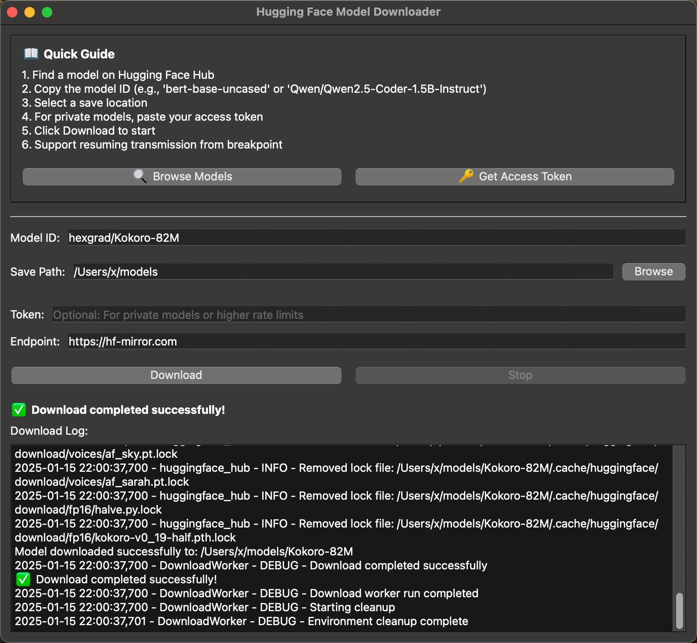

# hf-model-downloader

<div align="center">
  
  <br />
  
  <div id="download-section" style="margin: 20px 0;">
    <a href="#" onclick="downloadLatest(); return false;" style="text-decoration: none;">
      
    </a>
  </div>
  
  <br />
  <p>Downloads models from Hugging Face and ModelScope. Has a GUI so you don't need to mess with command lines.</p>
  <p>
    <a href="https://github.com/samzong/hf-model-downloader/releases"></a>
    <a href="https://github.com/samzong/hf-model-downloader/blob/main/LICENSE"></a>
    <a href="https://deepwiki.com/samzong//hf-model-downloader"></a>
  </p>
</div>



## What it does

- Downloads Hugging Face and ModelScope models through a simple GUI
- Handles authentication tokens
- Shows download progress
- Works on Windows and macOS (Apple Silicon)
- Creates standalone apps you can just run

## Just want to use it?

Download from [releases](https://github.com/samzong/hf-model-downloader/releases). Run the app. Done.

## Development

Requires [uv](https://docs.astral.sh/uv/).

```bash
git clone https://github.com/samzong/hf-model-downloader.git
cd hf-model-downloader

uv sync          # install deps (includes huggingface-hub[hf_xet])
uv run main.py   # run the app
```

## Build

```bash
# Build the application
make build

# Create DMG package (macOS only)
make dmg

# Clean build artifacts
make clean
```

## Code Quality

```bash
make format      # format code
make lint        # check code quality
make lint-fix    # auto-fix issues
make test        # fast smoke tests (Xet availability)
make test-e2e    # full download tests (network required)
make check       # format + lint + test + build
```

## Release

Merging to `main` cuts the release automatically: the tag is pushed with a draft GitHub release, which is published only after every platform asset is uploaded.

```bash
make release-dry-run  # preview the next version
```

**See all available commands:**
```bash
make help
```

## License

Under the MIT License - see the [LICENSE](LICENSE).
