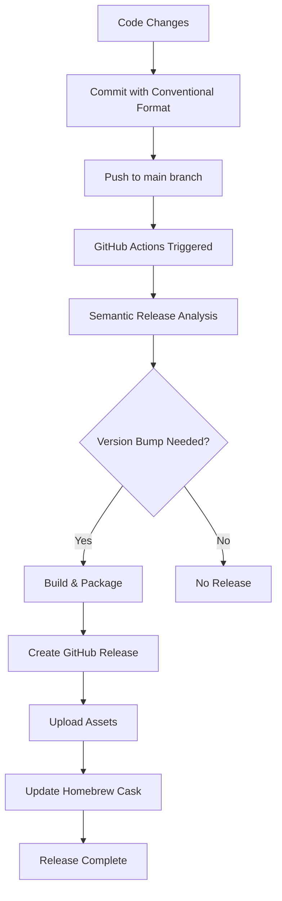

# HF Model Downloader - Complete Release Guide

This comprehensive guide covers the entire release workflow for the HF Model Downloader project, from development to distribution.

## Table of Contents

- [Overview](#overview)
- [Prerequisites](#prerequisites)
- [Release Workflow Types](#release-workflow-types)
- [Manual Release Process](#manual-release-process)
- [Automated Release Process](#automated-release-process)
- [Homebrew Distribution](#homebrew-distribution)
- [Post-Release Verification](#post-release-verification)
- [Troubleshooting](#troubleshooting)
- [Best Practices](#best-practices)
- [Emergency Procedures](#emergency-procedures)

## Overview

The HF Model Downloader uses **Semantic Release** for automated versioning and publishing. The release system supports:

- 🔄 **Automated releases** via GitHub Actions
- 📱 **Manual releases** for testing and hotfixes  
- 🍺 **Homebrew Cask** automatic updates
- 🏗️ **Multi-architecture** builds (ARM64 + x86_64)
- 📦 **DMG packaging** for macOS distribution

### Release Architecture



## Prerequisites

### Development Environment

1. **System Requirements**
   ```bash
   # macOS (for DMG creation)
   macOS 11.0+ (Big Sur or later)
   
   # Python Environment
   Python 3.13+
   pip package manager
   
   # Development Tools
   git 2.25+
   curl (for API calls)
   shasum (for checksums)
   ```

2. **Required Accounts & Tokens**
   ```bash
   # GitHub Account with repository access
   # Personal Access Token (classic) with scopes:
   - repo (full repository access)
   - workflow (update GitHub Actions)
   - write:packages (if using GitHub Packages)
   ```

3. **Environment Setup**
   ```bash
   # Clone repository
   git clone https://github.com/samzong/hf-model-downloader.git
   cd hf-model-downloader
   
   # Install dependencies
   make install
   
   # Verify environment
   make validate
   make check-deps
   ```

### GitHub Configuration

1. **Repository Secrets** (Settings → Secrets and variables → Actions)
   ```bash
   GH_TOKEN: ghp_xxxxxxxxxxxxxxxxxxxx (Personal Access Token)
   GH_PAT: ghp_xxxxxxxxxxxxxxxxxxxx (Same as GH_TOKEN, used by Homebrew script)
   ```

2. **Branch Protection Rules** (Settings → Branches)
   ```yaml
   Branch: main
   Protection rules:
   - Require pull request reviews before merging: ✅
   - Require status checks to pass before merging: ✅
   - Require branches to be up to date before merging: ✅
   - Include administrators: ❌ (for emergency fixes)
   ```

### Local Development Setup

```bash
# Install development dependencies
make dev-install

# Configure git for semantic commits
git config --global commit.template .gitmessage  # if exists

# Verify semantic-release configuration
make release-dry-run
```

## Release Workflow Types

### 1. Patch Release (Bug Fixes)
**Triggers**: Commits with `fix:`, `perf:`, `docs:`, `style:`, `refactor:`, `test:`, `chore:`, `ci:`, `build:`

**Example**:
```bash
git commit -m "fix: resolve memory leak in downloader process"
git commit -m "perf: optimize file checksum calculation"
```

### 2. Minor Release (New Features)  
**Triggers**: Commits with `feat:`

**Example**:
```bash
git commit -m "feat: add support for dataset downloads"
git commit -m "feat(ui): implement dark mode toggle"
```

### 3. Major Release (Breaking Changes)
**Triggers**: Commits with `BREAKING CHANGE:` in body or `!` after type

**Example**:
```bash
git commit -m "feat!: change configuration file format

BREAKING CHANGE: Configuration files now use YAML instead of JSON.
Existing config.json files need to be migrated to config.yaml format."
```

## Manual Release Process

### Step 1: Pre-Release Preparation

1. **Verify Current State**
   ```bash
   # Check current version
   make version
   
   # Verify clean working directory
   git status
   git pull origin main
   
   # Run full validation
   make validate
   make check-deps
   ```

2. **Test Build Process**
   ```bash
   # Clean build test
   make clean
   make test-build
   
   # Full package test (if on macOS)
   make package
   ```

3. **Commit Formatting Check**
   ```bash
   # Review recent commits for semantic format
   git log --oneline -10
   
   # Preview next version
   make release-dry-run
   ```

### Step 2: Execute Manual Release

1. **From Main Branch**
   ```bash
   # Ensure on main branch
   git checkout main
   git pull origin main
   
   # Execute release
   make release
   ```

2. **Verify Release Creation**
   ```bash
   # Check new version
   make version
   
   # Verify GitHub release
   make verify-release
   
   # Check release assets
   open "https://github.com/samzong/hf-model-downloader/releases"
   ```

### Step 3: Update Homebrew (Manual)

```bash
# Set environment variable
export GH_PAT="your_github_token_here"

# Update Homebrew cask
make update-homebrew

# Verify Homebrew PR creation
open "https://github.com/samzong/homebrew-tap/pulls"
```

## Automated Release Process

### GitHub Actions Workflow

The automated release is triggered by pushes to the main branch and consists of two main jobs:

#### Job 1: Semantic Release

**Runs on**: `macos-latest`  
**Triggers**: Push to main branch or manual workflow dispatch

**Steps**:
1. **Checkout** - Fetch full git history
2. **Setup Python 3.13** - Install Python environment
3. **Install Dependencies** - Install build tools and project dependencies
4. **Configure Git** - Set up bot user for commits
5. **Execute Semantic Release** - Analyze commits and create release

**Generated Artifacts**:
- New git tag (e.g., `v0.0.8`)
- Updated CHANGELOG.md
- GitHub release with DMG files
- Release notes based on commit messages

#### Job 2: Update Homebrew

**Runs on**: `ubuntu-latest`  
**Depends on**: Successful release job  
**Condition**: Only if a new release was created

**Steps**:
1. **Checkout** - Get latest code
2. **Extract Version** - Parse version from release
3. **Execute Homebrew Update** - Run automated cask update

### Monitoring Automated Releases

1. **GitHub Actions Dashboard**
   ```bash
   # Direct link to actions
   open "https://github.com/samzong/hf-model-downloader/actions"
   ```

2. **Release Status Checks**
   ```bash
   # Check if release completed
   curl -s "https://api.github.com/repos/samzong/hf-model-downloader/releases/latest" | jq '.tag_name'
   
   # Verify release assets
   make verify-release
   ```

3. **Homebrew Update Status**
   ```bash
   # Check for new Homebrew PR
   open "https://github.com/samzong/homebrew-tap/pulls"
   
   # Test Homebrew installation
   brew install --cask samzong/tap/hf-model-downloader --force
   ```

## Homebrew Distribution

### Overview

The Homebrew Cask provides an easy installation method for macOS users:

```bash
# Installation command
brew install --cask samzong/tap/hf-model-downloader
```

### Cask Update Process

The Homebrew cask is automatically updated after each release:

1. **Download Release Assets**
   - ARM64 DMG file
   - x86_64 DMG file

2. **Calculate Checksums**
   - SHA256 for each architecture
   - Verification of file integrity

3. **Update Cask Formula**
   - Version number bump
   - SHA256 hash updates for both architectures
   - Maintain on_arm/on_intel structure

4. **Create Pull Request**
   - Automated PR to homebrew-tap repository
   - Include version and checksum information
   - Auto-approve and merge (if configured)

### Manual Homebrew Update

If automatic update fails:

```bash
# Set required environment variable
export GH_PAT="your_github_token"

# Run manual update
make update-homebrew

# Alternative: Direct script execution
chmod +x scripts/homebrew-update.sh
./scripts/homebrew-update.sh
```

### Homebrew Testing

```bash
# Test cask installation
brew install --cask samzong/tap/hf-model-downloader --force

# Verify installation
/Applications/HF\ Model\ Downloader.app/Contents/MacOS/main --version

# Test cask removal
brew uninstall --cask hf-model-downloader
```

## Post-Release Verification

### Automated Verification Checklist

```bash
# 1. Verify version bump
make version

# 2. Check GitHub release
make verify-release

# 3. Test local build
make clean && make test-build

# 4. Verify DMG files exist and are downloadable
curl -I "https://github.com/samzong/hf-model-downloader/releases/latest/download/hf-model-downloader-arm64.dmg"
curl -I "https://github.com/samzong/hf-model-downloader/releases/latest/download/hf-model-downloader-x86_64.dmg"

# 5. Check Homebrew cask status
brew search samzong/tap/hf-model-downloader
```

### Manual Testing

1. **Download and Test DMG**
   ```bash
   # Download latest release
   VERSION=$(make version | grep -o '[0-9]\+\.[0-9]\+\.[0-9]\+')
   curl -L -o "test-hf-model-downloader.dmg" \
     "https://github.com/samzong/hf-model-downloader/releases/download/v${VERSION}/hf-model-downloader-$(uname -m | tr '[:upper:]' '[:lower:]').dmg"
   
   # Mount and test
   hdiutil attach test-hf-model-downloader.dmg
   /Volumes/HF\ Model\ Downloader/HF\ Model\ Downloader.app/Contents/MacOS/main --help
   hdiutil detach "/Volumes/HF Model Downloader"
   ```

2. **Homebrew Installation Test**
   ```bash
   # Fresh installation test
   brew uninstall --cask hf-model-downloader 2>/dev/null || true
   brew install --cask samzong/tap/hf-model-downloader
   
   # Launch test
   open -a "HF Model Downloader"
   ```

### Quality Assurance Checklist

- [ ] New version appears in GitHub releases
- [ ] Both ARM64 and x86_64 DMG files are present
- [ ] DMG files are downloadable and have correct checksums
- [ ] Homebrew cask has been updated with new version
- [ ] CHANGELOG.md reflects new changes
- [ ] Application launches successfully from DMG
- [ ] Application launches successfully from Homebrew install
- [ ] Core functionality works (download test)
- [ ] No obvious regressions in UI or performance

## Troubleshooting

### Common Issues

#### 1. Semantic Release Fails

**Problem**: `semantic-release` doesn't create a new version

**Solutions**:
```bash
# Check commit messages format
git log --oneline -10

# Verify semantic-release configuration
semantic-release version --dry-run --debug

# Fix: Ensure commits follow conventional format
git commit -m "fix: resolve issue description"
```

#### 2. Build Failures

**Problem**: PyInstaller build fails

**Solutions**:
```bash
# Check dependencies
make check-deps

# Reinstall dependencies
make clean
pip uninstall -y -r requirements.txt
make install

# Test build with verbose output
python build.py --debug  # if debug flag exists
```

#### 3. DMG Creation Fails

**Problem**: `dmgbuild` command fails

**Solutions**:
```bash
# Install dmgbuild
pip install dmgbuild

# Check dmg_settings.py exists
ls -la dmg_settings.py

# Verify .app bundle exists
ls -la dist/*.app/

# Manual DMG creation
cd dist
dmgbuild -s ../dmg_settings.py "HF Model Downloader" "hf-model-downloader-test.dmg"
```

#### 4. Homebrew Update Fails

**Problem**: Homebrew cask update fails

**Solutions**:
```bash
# Check environment variable
echo $GH_PAT

# Verify release files exist
make verify-release

# Manual homebrew update with debug
export DEBUG=1
make update-homebrew

# Check homebrew-tap repository access
git clone https://github.com/samzong/homebrew-tap.git test-tap
```

#### 5. GitHub Actions Failures

**Problem**: Actions workflow fails

**Diagnosis**:
```bash
# Check workflow status
gh run list --repo samzong/hf-model-downloader

# View specific run logs
gh run view <run-id> --repo samzong/hf-model-downloader

# Check repository secrets
gh secret list --repo samzong/hf-model-downloader
```

**Common fixes**:
- Verify `GH_TOKEN` secret is set and valid
- Check branch protection rules don't block bot commits
- Ensure runner has sufficient permissions
- Verify workflow file syntax

### Debug Mode

Enable debug output for troubleshooting:

```bash
# Enable verbose logging in scripts
export DEBUG=1
export VERBOSE=1

# Run with maximum output
make update-homebrew

# Check semantic-release debug
semantic-release version --dry-run --debug
```

### Log Analysis

```bash
# GitHub Actions logs
gh run view <run-id> --log

# Local build logs
make test-build 2>&1 | tee build.log

# Homebrew update logs
make update-homebrew 2>&1 | tee homebrew.log
```

## Best Practices

### Commit Message Guidelines

Use [Conventional Commits](https://www.conventionalcommits.org/) format:

```bash
<type>[optional scope]: <description>

[optional body]

[optional footer(s)]
```

**Examples**:
```bash
# Patch release triggers
fix: resolve download timeout issue
perf: improve file validation speed  
docs: update installation instructions
test: add unit tests for downloader module

# Minor release triggers  
feat: add progress bar to download dialog
feat(ui): implement drag and drop support

# Major release triggers
feat!: change configuration format to YAML

BREAKING CHANGE: Configuration files must be migrated from JSON to YAML format.
```

### Release Planning

1. **Version Strategy**
   - Use semantic versioning (MAJOR.MINOR.PATCH)
   - Group related changes in single releases
   - Avoid frequent major version bumps

2. **Testing Strategy**
   ```bash
   # Before any release
   make validate
   make test-build
   make clean && make package
   
   # Test on clean system if possible
   ```

3. **Documentation**
   - Update README.md for new features
   - Maintain CHANGELOG.md (automated by semantic-release)
   - Update version-specific documentation

### Automation Best Practices

1. **Reliable Builds**
   ```bash
   # Always clean before building
   make clean && make build
   
   # Use consistent build environment
   # Pin dependency versions in requirements.txt
   ```

2. **Error Handling**
   - All scripts should use `set -euo pipefail`
   - Implement proper cleanup with trap handlers
   - Provide meaningful error messages

3. **Security**
   - Use secrets for tokens, never hardcode
   - Rotate tokens regularly
   - Monitor for token exposure in logs

### Monitoring and Alerts

1. **Release Monitoring**
   ```bash
   # Monitor GitHub releases
   watch -n 300 "curl -s https://api.github.com/repos/samzong/hf-model-downloader/releases/latest | jq '.tag_name'"
   
   # Monitor Homebrew cask
   brew search samzong/tap/hf-model-downloader
   ```

2. **Quality Metrics**
   - Track download success rates
   - Monitor application crash reports
   - Track installation success from Homebrew

## Emergency Procedures

### Hotfix Release

For critical bugs requiring immediate release:

```bash
# 1. Create hotfix branch from main
git checkout main
git pull origin main
git checkout -b hotfix/critical-bug-fix

# 2. Make minimal fix
# Edit files...
git add .
git commit -m "fix: resolve critical security vulnerability"

# 3. Test fix
make validate
make test-build

# 4. Merge to main and release
git checkout main
git merge hotfix/critical-bug-fix
git push origin main

# 5. Monitor automated release
# Or trigger manual release if needed
make release
```

### Rollback Procedure

If a release introduces critical issues:

```bash
# 1. Create rollback release
git checkout main
git revert <problematic-commit-hash>
git commit -m "fix: rollback problematic changes from v<version>"

# 2. Push and release
git push origin main
# Wait for automated release or trigger manually

# 3. Update Homebrew immediately
export GH_PAT="your_token"
make update-homebrew

# 4. Communicate rollback
# Update GitHub release notes
# Notify users via appropriate channels
```

### Failed Release Recovery

If automated release fails mid-process:

```bash
# 1. Check release state
make version
make verify-release

# 2. If version was bumped but release failed
# Check GitHub releases page
# Manually create release if needed

# 3. If Homebrew update failed
# Run manual Homebrew update
export GH_PAT="your_token"
make update-homebrew

# 4. Clean up any partial state
make clean
git status
# Reset if needed: git reset --hard origin/main
```

### Communication Templates

#### Release Announcement
```markdown
## 🚀 HF Model Downloader v{version} Released

### New Features
- Feature 1 description
- Feature 2 description

### Bug Fixes  
- Fix 1 description
- Fix 2 description

### Installation
```bash
# Homebrew (recommended)
brew install --cask samzong/tap/hf-model-downloader

# Direct download
# Available at: https://github.com/samzong/hf-model-downloader/releases/latest
```

### Upgrade Notes
- Any breaking changes
- Migration instructions
```

#### Hotfix Notification
```markdown
## 🚨 Critical Hotfix: HF Model Downloader v{version}

A critical issue was discovered in the previous release that could affect [impact description].

### Immediate Action Required
Please update to v{version} immediately.

### How to Update
```bash
brew upgrade hf-model-downloader
```

### What's Fixed
- Critical issue description
- Impact and resolution
```

---

## Conclusion

This release guide provides comprehensive coverage of the HF Model Downloader release process. For questions or improvements to this guide, please open an issue or submit a pull request.

**Quick Reference Commands**:
```bash
# Daily development
make validate && make test-build

# Manual release
make release-dry-run && make release

# Verify release
make verify-release

# Emergency procedures  
make update-homebrew
```

**Support**: For release-related issues, check the [Troubleshooting](#troubleshooting) section or open a GitHub issue with the `release` label.